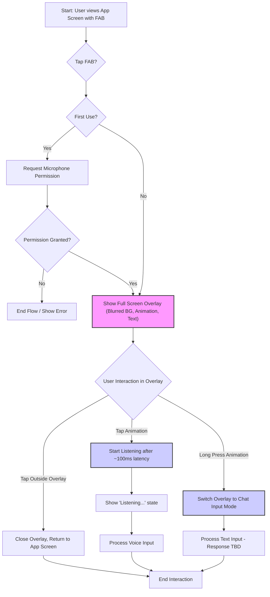
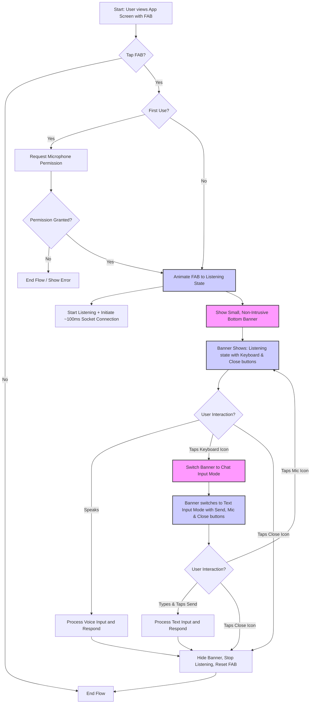

```mermaid


```

Current user flow:

```mermaid  
graph TD

A[Start: User views App Screen with FAB] --> B{Tap FAB?};

B --> C{First Use?};

C -- Yes --> D[Request Microphone Permission];

D --> E{Permission Granted?};

E -- No --> F[End Flow / Show Error];

E -- Yes --> G["Show Full Screen Overlay (Blurred BG, Animation, Text)"];

C -- No --> G;

  

G --> H{User Interaction in Overlay};

H -- Tap Animation --> I["Start Listening after ~100ms latency"];

I --> J["Show 'Listening...' state"];

H -- Long Press Animation --> K[Switch Overlay to Chat Input Mode];

H -- Tap Outside Overlay --> L[Close Overlay, Return to App Screen];

  

J --> M[Process Voice Input];

K --> N[Process Text Input - Response TBD];

L --> End[End Interaction];

M --> End;

N --> End;

  

style G fill:#f9f,stroke:#333,stroke-width:2px

style I fill:#ccf,stroke:#333,stroke-width:2px

style K fill:#ccf,stroke:#333,stroke-width:2px
```

New user flow:

```mermaid
graph TD

A[Start: User views App Screen with FAB] --> B{Tap FAB?};

  

B -- No --> End[End Flow];

B -- Yes --> C{First Use?};

C -- Yes --> D[Request Microphone Permission];

D --> E{Permission Granted?};

E -- No --> F[End Flow / Show Error];

E -- Yes --> G[Animate FAB to Listening State];

  

C -- No --> G;

  

G --> H[Start Listening + Initiate ~100ms Socket Connection];

G --> I[Show Small, Non-Intrusive Bottom Banner];

I --> J[Banner Shows: Listening state with Keyboard & Close buttons];

  

J --> K{User Interaction?};

K -- Speaks --> L[Process Voice Input and Respond];

K -- Taps Keyboard Icon --> M[Switch Banner to Chat Input Mode];

K -- Taps Close Icon --> N[Hide Banner, Stop Listening, Reset FAB];

  

M --> O[Banner switches to Text Input Mode with Send, Mic & Close buttons];

O --> P{User Interaction?};

P -- Types & Taps Send --> Q[Process Text Input and Respond];

P -- Taps Mic Icon --> J;

P -- Taps Close Icon --> N;

  

L --> N;

Q --> N;

  

N --> End;

  

style G fill:#ccf,stroke:#333,stroke-width:2px;

style I fill:#f9f,stroke:#333,stroke-width:2px;

style J fill:#ccf,stroke:#333,stroke-width:2px;

style M fill:#f9f,stroke:#333,stroke-width:2px;

style O fill:#ccf,stroke:#333,stroke-width:2px;
```